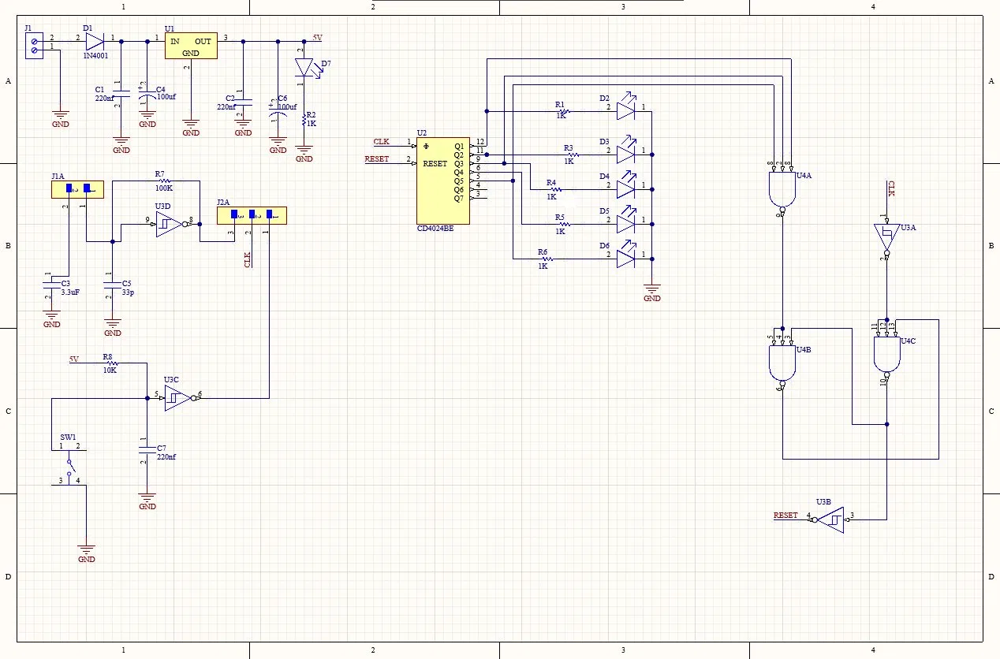
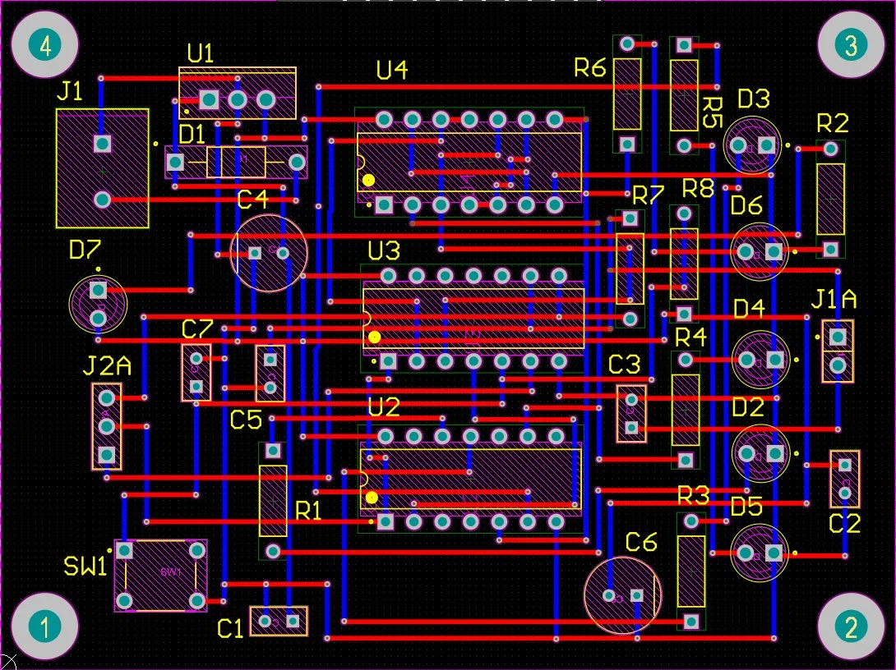
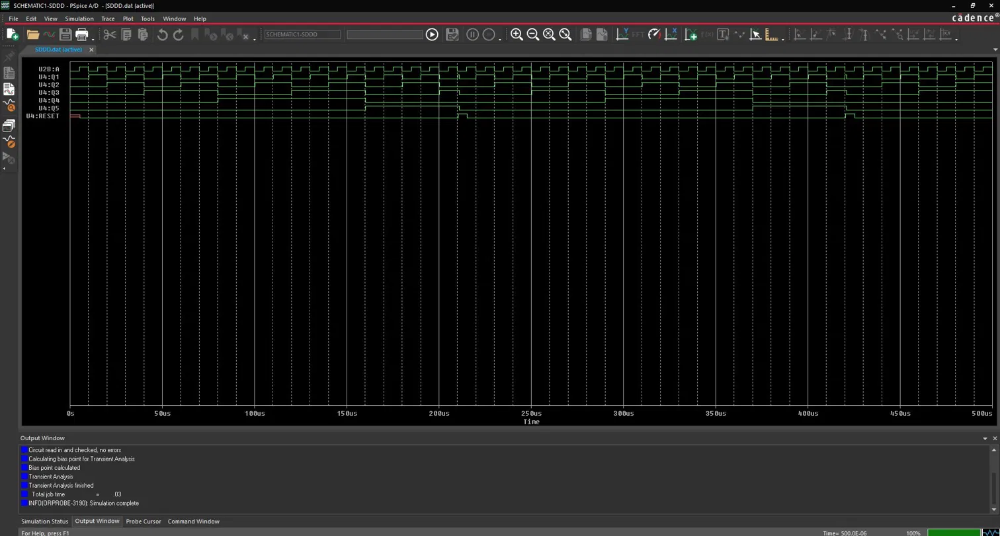

# Modulo-22 Binary Counter — Full PCB Design

> Syncretic project for the **Digital Integrated Circuits** course  
> Faculty of Electronics, Telecommunications & Information Technology — Universitatea Politehnica Timișoara  
> Year 2 · 2024–2025

---

## Overview

A complete hardware implementation of a **modulo-22 synchronous binary counter** built with CMOS Series 4000 ICs.  
The counter increments on each clock pulse and automatically resets to 0 when it reaches the count of 22, using combinational RESET logic derived from the output bits.

The project covers the full design flow: **schematic → PCB layout → simulation**.

---

## Features

- Counts from 0 to 21 (22 states), then resets automatically
- RESET logic implemented with AND gates and inverters (no microcontroller)
- 6x LED output indicators (Q1–Q5 + overflow visual)
- On-board 5V power supply with rectifier and voltage regulator
- Clock generator with RC oscillator network
- 2-layer PCB designed and routed in Altium Designer

---

## ICs Used

| Component | Function |
|-----------|----------|
| CD4024BE | 7-stage binary ripple counter |
| CD4073 | Triple 3-input AND gate (RESET logic) |
| CD4069 | Hex inverter (RESET logic) |
| IN4001 | Rectifier diode (power supply) |
| Voltage regulator | 5V supply stabilization |

---

## Project Structure

```
modulo-22-counter/
├── schematic/
│   ├── schematic_screenshot.png      # Full schematic (Altium Designer)
│   └── *.SchDoc                      # Altium schematic source file
├── pcb/
│   ├── pcb_layout_screenshot.png     # 2-layer PCB layout (Altium Designer)
│   └── *.PcbDoc                      # Altium PCB source file
├── simulation/
│   ├── simulation_waveforms.png      # PSpice transient simulation (Q1–Q5 + RESET)
│   └── *.opj                         # OrCAD PSpice project files
└── README.md
```

---

## Schematic

The schematic is divided into four functional blocks:

1. **Power Supply** — AC input via J1, rectified through IN4001, filtered with decoupling capacitors (220nF, 100μF), regulated to 5V. Power LED indicator D7.
2. **Clock Generator** — RC oscillator using U3C/U3D inverters, 3.3μF + 33pF capacitors, 100K/10K resistors, with external clock input option via J2A.
3. **Counter Core** — CD4024BE 7-stage binary counter clocked by the oscillator. Outputs Q1–Q5 routed to LED indicators and RESET logic.
4. **RESET Logic** — CD4073 AND gates (U4A, U4B, U4C) and CD4069 inverter (U3B) detect count 22 (10110₂) on Q1–Q5 and pull RESET high to restart the counter.



---

## PCB Layout

- **2-layer board** designed in Altium Designer
- **Top layer** (red) — signal routing
- **Bottom layer** (blue) — signal routing and ground returns
- Through-hole components; mounting holes at all four corners
- DRC (Design Rule Check) passed with no errors



---

## Simulation

Transient simulation performed in **OrCAD PSpice (Cadence)** over a 500μs window.

Signals verified:
- `U2B:A` — Clock input
- `V4:Q1` through `V4:Q5` — Counter output bits
- `V4:RESET` — Automatic reset pulse at count 22

The simulation confirms the counter correctly resets after 22 clock pulses with no glitches on the RESET line.

S

---

## Tools Used

| Tool | Purpose |
|------|---------|
| Altium Designer | Schematic capture, PCB layout, DRC |
| OrCAD PSpice (Cadence) | Transient circuit simulation |
| Microsoft Office | Project documentation |

---

## Author

**Bejinaru Laurian Giorgian**  
Student — Electronics, Telecommunications & Information Technology  
Universitatea Politehnica Timișoara  
📧 laurian.bejinaru@student.upt.ro
